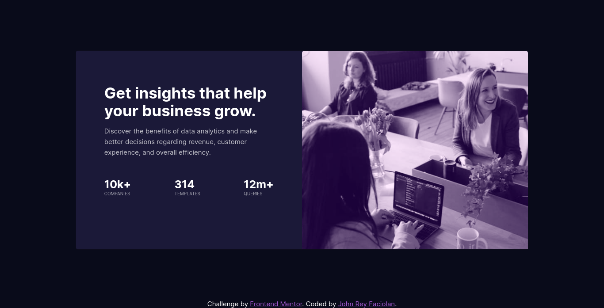
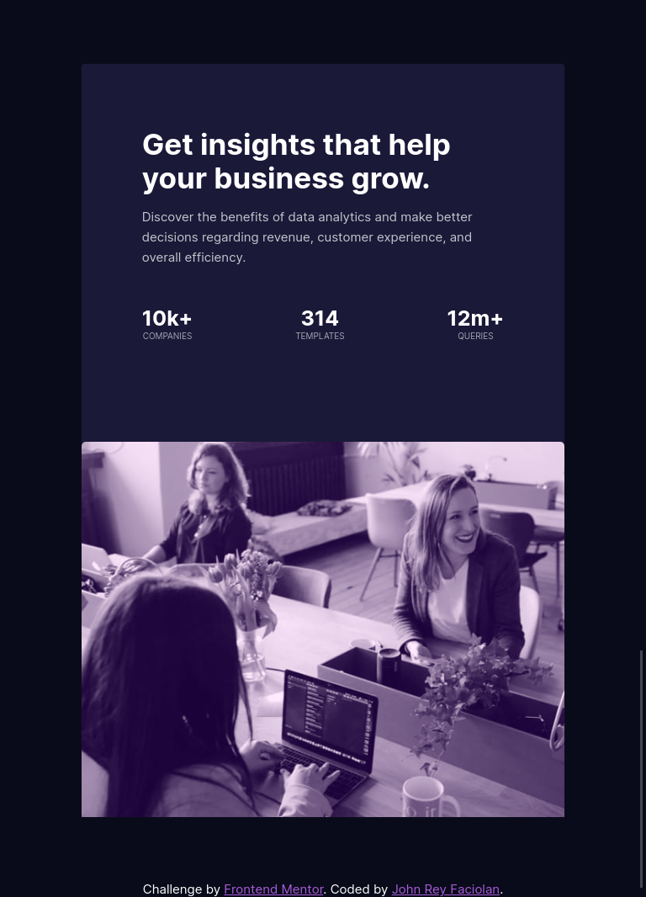

# Frontend Mentor - Stats preview card component solution

This is a solution to the [Stats preview card component challenge on Frontend Mentor](https://www.frontendmentor.io/challenges/stats-preview-card-component-8JqbgoU62). Frontend Mentor challenges help you improve your coding skills by building realistic projects. 

## Table of contents

- [Overview](#overview)
  - [The challenge](#the-challenge)
  - [Screenshot](#screenshot)
  - [Links](#links)
- [My process](#my-process)
  - [Built with](#built-with)
  - [What I learned](#what-i-learned)
  - [Continued development](#continued-development)
  - [Useful resources](#useful-resources)
- [Author](#author)
- [Acknowledgments](#acknowledgments)

**Note: Delete this note and update the table of contents based on what sections you keep.**

## Overview

### The challenge

Users should be able to:

- View the optimal layout depending on their device's screen size

### Screenshot

### Links

- Solution URL: [Cheeck out my Github repository](https://github.com/juani2/stats-preview-challenge--solution)
- Live Site URL: [Check out my live site here](https://silly-heyrovsky-ddb68e.netlify.app/)

## My process

### Built with

- Semantic HTML5 markup
- Vanilla CSS
- Flexbox
- Graceful degradation workflow

### What I learned

In this challenge, I was able to learn how to analyze image-only designs and analyze it in order to code the design much easier. As of my current level, I wasn't able to achieve a pixel perfect implementation of the challenge.

My flexbox and media query skills were put to test.
In this challenge, I found out that flexbox and media query can enhance user experience
by altering size, alignment and order based on the currently available screen real estate.

### Continued development
My current implementation was still far from the target design.
I still need to enhance my skill in analyzing and identifying the right combination of font-size and white spaces.

Also, the current implementation is not flexible and extensible.
Maybe I could improve the code by applying BEM principles but as of now, I need further practice.

### Useful resources

- [MDN Docs](https://developer.mozilla.org/en-US/) - This site really helped me in digesting core HTML/CSS principles

## Author

- Website - [John Rey Faciolan](http://github.com/juani2)
- Frontend Mentor - [@juani2](https://www.frontendmentor.io/profile/juani2)